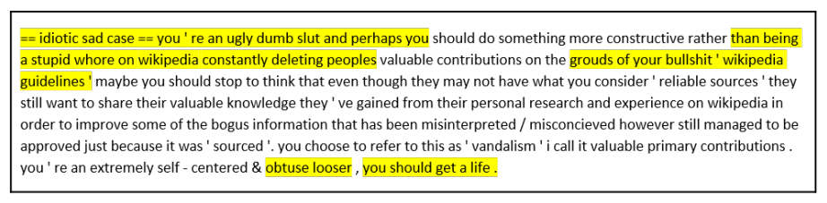
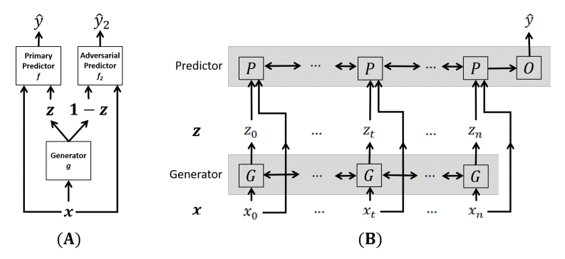

# Extractive-Adversarial-Networks
["Extractive Adversarial Networks: High-Recall Explanations for Identifying Personal Attacks in Social Media Posts"](https://arxiv.org/abs/1809.01499)

## Dataset
논문에서 사용한 [데이터](https://meta.wikimedia.org/wiki/Research:Detox/Data_Release)

## Introduction
논문에서는 Online abuse(온라인상에서의 개인적 공격을 주로 다룬다)을 분류하기 위한 Extractive Adversarial Networks를 제안한다.

    

논문에서 소개된 예, 공격적인 comment를 모델이 식별한 결과이다.

## Model Architecture

    

모델은 Generator 1개, Predictor 2개로 이루어져 있으며, 각각 RNNs 구조를 사용한다. 모델의 학습은 REINFORCE-style policy gradient optimization을 활용하였다.

## Related works
* [Rationalizing neural predictions](https://github.com/YujiaBao/R2A/tree/master/rationalization)
* [Deriving Machine Attention from Human Rationales](https://github.com/YujiaBao/R2A)
